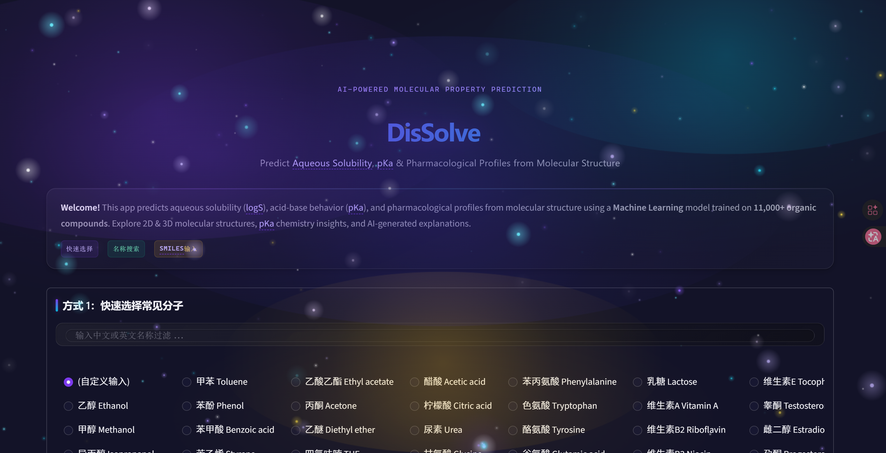
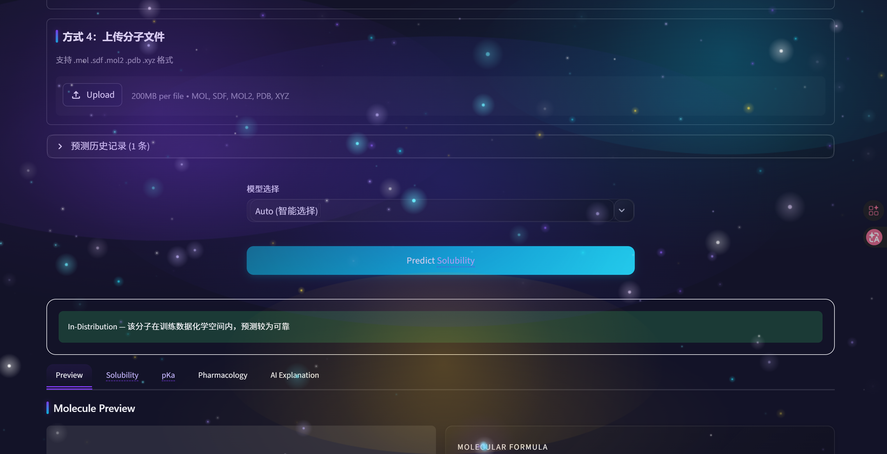
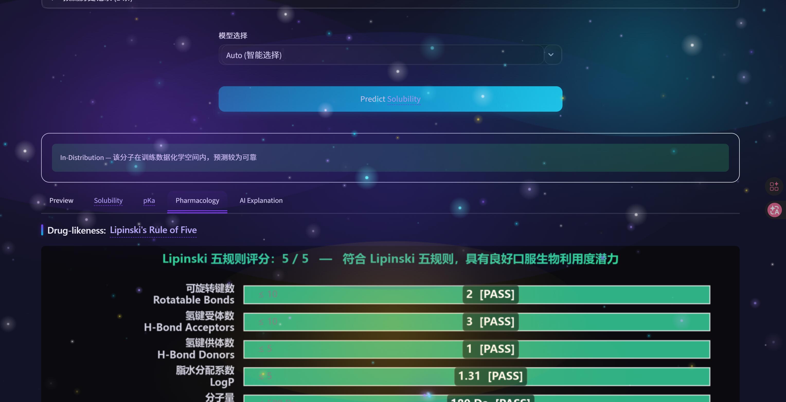

#  Molecular Solubility Predictor

Predict aqueous solubility (logS) of organic molecules using Machine Learning.

[](https://chem-ml-project.streamlit.app)
[](https://github.com/minlangli26-cyber/chem-ml-project/actions/workflows/test.yml)

##  Overview

This web application predicts how well a molecule dissolves in water (**logS**) from its molecular structure (SMILES string). It combines:

- **RDKit** for cheminformatics and molecular feature extraction
- **Random Forest** model trained on **11,000+ organic compounds**
- **PubChem API** for real-time molecule lookup
- **Kimi AI (Moonshot)** for chemistry explanations in plain Chinese

Built as a high school chemistry + machine learning project.

##  Live Demo

> Replace this badge/link once deployed on [Streamlit Community Cloud](https://streamlit.io/cloud).

##  Screenshots

| Input & Search | Solubility Prediction | Pharmacology Analysis |
|:---:|:---:|:---:|
|  |  |  |

##  Tech Stack

| Layer | Technology |
|-------|------------|
| Frontend | Streamlit |
| ML Model | Scikit-learn (Random Forest) |
| Cheminformatics | RDKit |
| Fingerprint | Morgan (ECFP4, 1024-bit) |
| Descriptors | MolWt, LogP, TPSA, H-bonds, Rotatable Bonds, Rings |
| AI Explanation | Kimi API (OpenAI-compatible) |
| External Data | PubChem PUG REST API |

##  Project Structure

```
.
├── app.py                      # Main Streamlit application
├── features.py                 # Molecular feature computation
├── molecules.py                # Local DB + PubChem search
├── model.py                    # Model loading & inference
├── gnn_model.py                # Graph Neural Network (GIN)
├── ood_detector.py             # Out-of-Distribution detection
│
├── core/                       # Business logic modules
│   ├── analysis.py             # pKa, Lipinski, ADME/Tox
│   ├── ai_client.py            # Kimi AI explanation client
│   ├── cache.py                # Streamlit caching wrappers
│   └── state_keys.py           # Session state constants
│
├── ui/                         # UI rendering
│   ├── components.py           # Header, footer, input areas
│   ├── results.py              # 5-tab results display
│   └── plots.py                # 2D/3D molecule visualization
│
├── assets/                     # CSS theme & JS effects
│
├── tests/                      # Unit tests (pytest)
│   ├── test_features.py
│   ├── test_analysis.py
│   ├── test_model.py
│   ├── test_molecules.py
│   └── test_ood_detector.py
│
├── output_v2/                  # Trained models
├── data/                       # Training datasets (CSV)
├── docs/                       # Screenshots
├── .env                        # API keys (not tracked)
├── requirements.txt
├── .gitignore
└── README.md
```

##  Quick Start

### 1. Clone the repository

```bash
git clone https://github.com/YOUR_USERNAME/chem-ml-project.git
cd chem-ml-project
```

### 2. Create a virtual environment

```bash
# Using venv
python -m venv venv

# Windows
venv\Scripts\activate

# macOS/Linux
source venv/bin/activate
```

### 3. Install dependencies

> **Note:** RDKit is easiest to install via **conda**. If you use pip, make sure you have the required system libraries.

```bash
# Option A: Conda (recommended for RDKit)
conda install -c conda-forge rdkit
pip install -r requirements.txt

# Option B: Pure pip (if RDKit wheel is available for your platform)
pip install -r requirements.txt
```

### 4. Configure API keys

Create a `.env` file in the project root:

```env
KIMI_API_KEY=sk-your-moonshot-api-key-here
```

> You can get a free API key from [Moonshot AI](https://platform.moonshot.cn/).
> The app works without it, but the AI explanation feature will be disabled.

### 5. Prepare model files

If you don't have the trained model yet, run the training script (requires dataset):

```bash
python train_model_v2.py
```

Or download the pre-trained model from [Releases](YOUR_RELEASES_LINK) and place it in `output_v2/`.

### 6. Run the app

```bash
streamlit run app.py
```

The app will open at `http://localhost:8501`.

##  How It Works

### Input Methods

1. **Dropdown Menu** — 100+ built-in molecules (drugs, vitamins, hormones, pollutants, etc.)
2. **Name Search** — Three-tier search: local exact match → local fuzzy match → PubChem API
3. **Direct SMILES** — Paste any valid SMILES string

### Feature Engineering

For each molecule, RDKit extracts 8 molecular descriptors + 1024-bit Morgan fingerprint:

| Feature | Description |
|---------|-------------|
| MolWt | Molecular weight (g/mol) |
| LogP | Lipophilicity (octanol/water partition) |
| TPSA | Topological Polar Surface Area (Ų) |
| NumHDonors | Hydrogen bond donors |
| NumHAcceptors | Hydrogen bond acceptors |
| NumRotatableBonds | Molecular flexibility |
| NumAromaticRings | Aromatic ring count |
| NumAliphaticRings | Aliphatic ring count |
| Morgan FP | 1024-bit circular fingerprint (ECFP4) |

### Prediction Interpretation

| logS Range | Solubility | Example |
|------------|------------|---------|
| > 0 | Highly soluble | Ethanol |
| -2 ~ 0 | Moderately soluble | Many drug molecules |
| < -2 | Poorly soluble | Hydrophobic compounds |

##  AI Explanation

The app optionally calls **Kimi (Moonshot AI)** to generate a student-friendly explanation:
- Solubility conclusion
- Structural reasoning (polarity, hydrogen bonding, hydrophobicity)
- Real-life analogy

This is triggered manually to respect API rate limits and costs.

##  Model Training

The training pipeline (`train_model_v2.py`) typically includes:

1. Load solubility dataset (e.g., ESOL, AqSolDB, or custom curated data)
2. SMILES → RDKit molecular features + Morgan fingerprints
3. Train/test split
4. Random Forest regression with hyperparameter tuning
5. Save model + descriptor names for inference

> **Note:** The training script and raw datasets are not included in this repo due to size. Contact me if you're interested in the full pipeline.

##  Deployment

### Streamlit Community Cloud (Free)

1. Push your code to GitHub (include `requirements.txt`)
2. Go to [share.streamlit.io](https://share.streamlit.io)
3. Connect your repo and select `app.py`
4. Add `KIMI_API_KEY` in **Secrets management**
5. Deploy!

### Important Deployment Notes

- **Model files**: If `solubility_model_v2.pkl` > 100MB, use [Git LFS](https://git-lfs.github.com/) or host on a cloud storage bucket.
- **RDKit**: Streamlit Cloud supports it via `requirements.txt`, but build time may be long. Consider using a lighter base image if needed.
- **PubChem API**: The app includes rate limiting (1.2s delay) and SSL workarounds for Chinese networks.

##  Contributing

This is a personal learning project, but suggestions and issues are welcome!

##  License

[MIT License](LICENSE)

##  Acknowledgments

- [RDKit](https://www.rdkit.org/) — Cheminformatics toolkit
- [PubChem](https://pubchem.ncbi.nlm.nih.gov/) — Chemical database
- [Streamlit](https://streamlit.io/) — Web app framework
- [Moonshot AI](https://www.moonshot.cn/) — Kimi large language model
- [ESOL Dataset](https://pubs.acs.org/doi/10.1021/ci034243x) — Solubility data (Delaney, 2004)

---

Built by Leonlee
